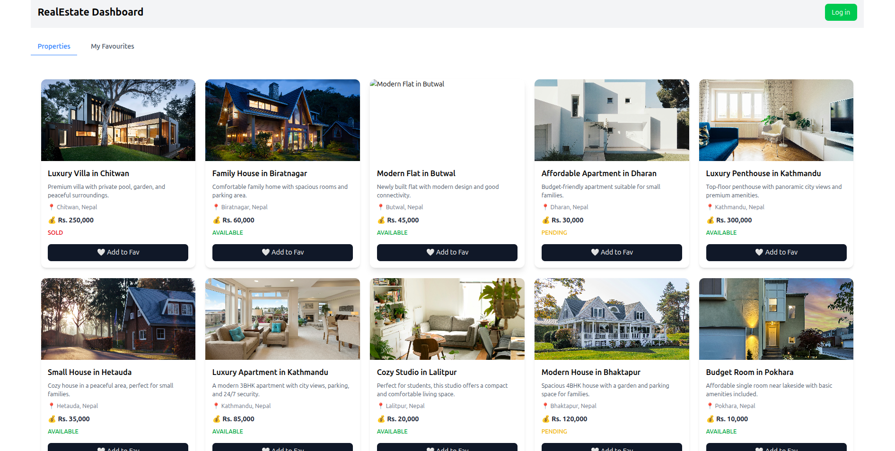
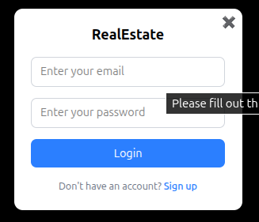
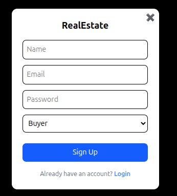
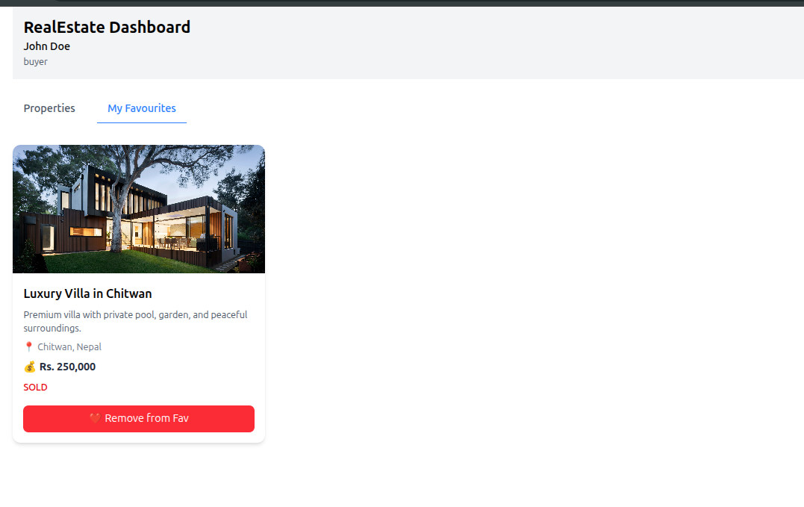

# Real Estate Buyer Portal (Junior Full-Stack Assessment)

## Project Overview

A simple **buyer portal for a real-estate broker**, built as part of a take-home assessment for a Junior Full-Stack Engineer role.

**Features:**

- User registration and login (email + password)
- JWT-based authentication
- Dashboard showing the logged-in user's name and role
- "My Favourites" list of properties
- Ability to add/remove properties to/from favourites
- Users can only see and modify their own favourites
- Basic frontend with login page and dashboard

---

## Tech Stack

- **Frontend:** React (with hooks)
- **Backend:** Node.js + Express
- **Authentication:** JWT
- **Database:** MongoDB Atlas

---

## Folder Structure

```
project-root/
├─ backend/          # Node.js backend code
│  ├─ src/
│  └─ package.json
├─ client/           # React frontend
│  ├─ src/
│  └─ package.json
└─ README.md
```

---

## Setup Instructions

### 1. Clone the repository

```bash
git clone https://github.com/ranjanthapa/realstate-assessment.git
cd realstate-assessment
```

### 2. Install dependencies

**Backend**
```bash
cd backend
npm install
```

**Frontend**
```bash
cd ../client
npm install
```

### 3. Environment Configuration

Create a `.env` file in the `backend` folder:

```env
# MongoDB Atlas connection string
CONNECTION_STRING=<your-mongodb-atlas-connection-string>

# JWT secret for authentication
JWT_SECRET=<your-secret-key>
```

---

## API Endpoints & Usage

### 1. User Registration (Sign Up)

**Endpoint:**
```
POST http://localhost:5000/api/auth/sign-up
```

**Request Body:**
```json
{
  "name": "John Doe",
  "email": "jhef.do@example.com",
  "password": "password123",
  "role": "seller"
}
```

> `role` can be `"seller"` or `"buyer"`.

**Response:** Returns created user info and status.

---

### 2. User Login

**Endpoint:**
```
POST http://localhost:5000/api/auth/login
```

**Request Body:**
```json
{
  "email": "jhef.do@example.com",
  "password": "password123"
}
```

**Response:**
```json
{
  "status": "success",
  "data": {
    "id": "69c8a3d7572fca83adeda985",
    "name": "John Doe",
    "role": "buyer",
    "jwtToken": "<JWT_TOKEN>"
  }
}
```

> The `jwtToken` must be sent in the `Authorization` header for all protected routes.

---

### 3. View All Properties (Public)

**Endpoint:**
```
GET http://localhost:5000/api/properties
```

Lists all properties. Accessible to non-logged-in users.

---

### 4. Add Property to Favourites

**Endpoint:**
```
POST http://localhost:5000/api/favourites/:propertyId
```

**Headers:**
```
Authorization: Bearer <JWT_TOKEN>
```

**Example:**
```
POST http://localhost:5000/api/favourites/69c6ba2c288df6201812b520
```

Adds the property to the logged-in user's favourites.

---

### 5. Remove Property from Favourites

**Endpoint:**
```
DELETE http://localhost:5000/api/favourites/:propertyId
```

**Headers:**
```
Authorization: Bearer <JWT_TOKEN>
```

**Example:**
```
DELETE http://localhost:5000/api/favourites/69c6ba2c288df6201812b520
```

Removes the property from the logged-in user's favourites.

---

### 6. Seed the Database

```bash
npm run seed
```

Seeds the database with sample properties for testing.


### Home page


### Pop up login card and signup card





### property added to fav
